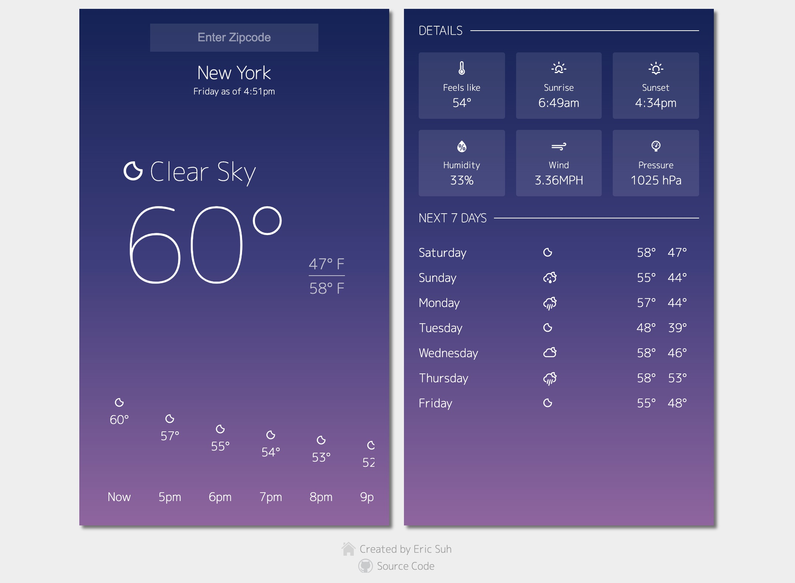

# Weather App
Customized starter app for using react + redux

[Demo Site](http://weather.eric-suh.com)

## Tech Stack
- React
- Redux (using redux-toolkit)
- Sass
- Webpack
- Eslint

## Features
- Fully responsive design.
- Hourly weather with graphical representation.
- Current weather details.
- Background color changes based on weather description.
- 7 days forecast.
- Data gathered from OpenWeatherMap, via their public API. Works with US zipcode only.
- Weather data saved through localstorage. Data is updated on page refresh (if after 10 minutes).

